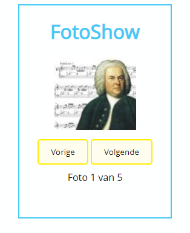
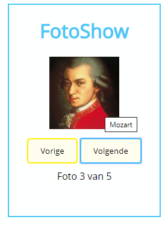

# oe-objecten-arrays-componisten-start
StartFile voor ComponistenOefening

# Componisten
## Functionaliteit
De gebruiker kan op de knoppen Vorige en Volgende klikken. Wanneer dit wordt uitgevoerd dan worde de afbeelding van de vorige (of volgende) componist getoond en de inhoud van de tekst 'Foto 1 van 5 aangepast'.
Wanneer de gebruiker met zijn pointer over de afbeelding komt dat wordt de naam van de componist getoond. (Tooltip)

Maak gebruik van een Array van Objecten om deze toepassing te maken.

> Schrijf de nodige codelogica zodat bij 'volgende' na foto 5 terug de eerste componist wordt getoond en bij 'vorige' bij foto 1 de laatste componiste wordt getoond.
## Sfeerbeelden
### Opstart

### Hover
